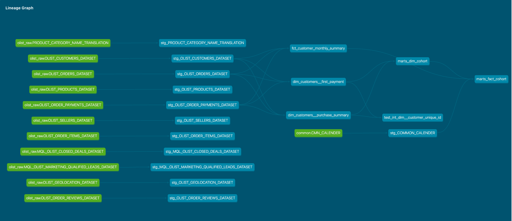

# Enterprise Cohort Analytics & Data Ops Platform (dbt × Snowflake)

## 1. Project Overview & Business Objective
This is the Data Pipeline for cohort analytics with Ecommerce Data

### Data Source
Dataset : [Brazilian E-Commerce Public Dataset by Olist](https://www.kaggle.com/datasets/olistbr/brazilian-ecommerce)

### About Olist
[Olist](https://olist.com/) is One of the biggest Ecommerce Platform in Brazil, 


### Purpose
In their business, they want to see the customer retention to make segments of customers.
And Ec business, its data is basically composed by 3 relational datasets, Order / Customer / Items.
The cohort analytics drives strategic customer segmentation.

### About Cohort
The basic but strong analytics method for this kind of business.
Cohort is often compared with Grouping because Cohort also means separating people with same attributions

The difference is where they focus on, Group focus on comparison of 1 fixed period.
like "Aggregated Sales revenue in Each CardRanks in last year"

In Cohort analytics, we focus more on "People's Monthly Revenue Movement After the buying".
like "How often do they buy after first purchasing?"  
And "Is their differences between people who bought in Spring and Winter?"

* Group
    * Separate people by common attributions and compare them in fixed period
    * Visualized by bar chart, to compare the amount itself.
* Cohort
    * Separate people by common attributions and compare their movement after the specific actions
    * Visualized by heatmap or line chart, to compare the movement of each group

### Project Description
In this project, I implemented the DataPipeline for cohort analytics workflow for snowflake with dbt. 
This project doesn't need dbt Cloud, the automated build process is working on Github Actions Runner
, which means the project is Financially optimized.

And the Visualization is implemented in Snowflake as Streamlit Application,
The Application is in [this repository](https://github.com/lovehakumai/olist_cohort_analytics_snowflake)

Each models are separated into 3 layers and as a result it will create 2 tables in Snowflake.
They are Star-Schema architecture, which will help your flexible analytics with BI tools(Tableau , PowerBI...)

* 3 Layers
    * Staging : Create Views by basic transforming such as converting data type, changing name...
    * Intermidiate(fact/dim) : Create the base models for creating mart with complicated transfomations
    * Mart : Create the Table for Analytics user from Intermidiate Models

## 2. Data Architecture & DAG Lineage
[📄 Interactive Data Documentation & Lineage DAG](https://lovehakumai.github.io/olist_cohort_analytics_dbt/)


## 3. Analytics Engineering Highlights
### Ensuring Idempotency of Result 
As you can see above, the models are transformed in several times.  
CTE is known as useful way to develop the pipeline but dbt can't run the tests in CTE parts.  
This composement helps project having idempotency by putting test in each timing.  

### Automated Building Process with Github Actions Workflows  
This pipeline is doesn't use dbt cloud for running automatically,It uses Github Actions instead of it.  
※dbt cloud: UI application with good UI for developing and managing dbt project.   

Github Actions is One of the Github Services which helps us to kick dbt commands automatically.  
* The points : 
    * Github Actions can run the commands in secured way with Encrypted Variables(Github Secrets)
    * Github Actions work has Free tier(※amount of running is limited but it's enough for this project)

## 4. Modern Data Ops & Automated CI/CD Pipeline
### SlimCI : 
I implemented Slim CI in Github Actions Workflow.  
This is dbt's standard feature, When you change codes in outside of main branch  
It will compare the previous manifest.json and new manifest.json   
and run ```dbt build --select state:modified+``` command on isolated ephemeral schema in Snowflake.  

You can push or merge it after checking the new codes works as you expected in snowflake.  

### Incremental Feature:
The data might be bigger in the future so that data needs capability of having incremental updating.
dbt has the feature for it, ```config(materialized =  'incremental')```.  

If the tables already exits, It will be converted into ```MERGE``` command in Snowflake(update or insert).  
It helps snowflake update the table financially efficiently with lower credit than having full replacement.

In the same time, I implemented the ```if statement``` to optimize the data.  
```python

    WHERE last_purchase_at >= (SELECT MAX(last_purchase_at) FROM {{this}})

```
Which decrease the data snowflake needs to check the status.

## 5. Data Quality Governance (Testing & Documentation)
### Generic Test
Each models include specific grain and its unique column (or columns ).
dbt(and its library dbt-utils) has standard test algorithm for checking if the unique key is real unique one or not.

### Singular Test
I implemented custom test file ```test_int_dim__customer_unique_id.sql```   
which checks the customer_unique_id in ```marts_dim_cohort.sql``` And ```marts_fact_cohort.sql``` are the same.
This test proves that the data is based on the latest data and the models works as expected.